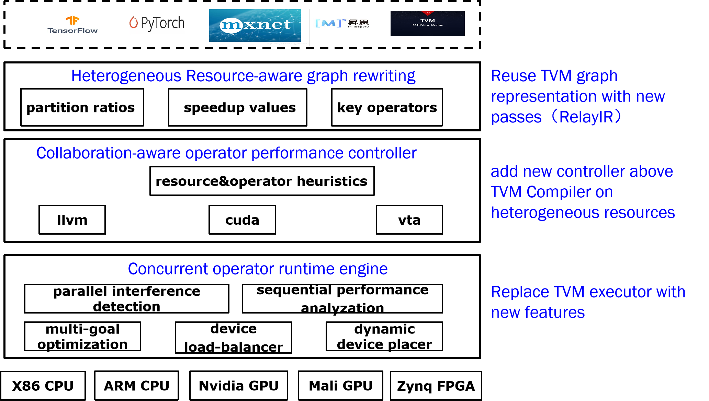

# OpBench
Based on TVM. Profiling op performance with many features.

# op based computation graph

operator execution time and heterogeneous resource efficiency are affected by many features, includes intra-op parallel implementation, resource usage and inter-op parallel sequence. Only considering them both can gain sufficient operator performance data.

We believe we make the following factors:

1. intra-operator factors:

| name | range | comment |
| -- | -- | -- |
| input size | 1*1~4096*4096 | input data of many operators |
| tile size | 1~10 | used in Conv2D |
| fuse | -- | for different matrixes |
| reorder | N dimensions | for high dimension data |
| compute_at | inline/root | for for-loop blocks |
| split | 2 | for large data size |

2. inter-operator factors:

| name | range | comment |
| -- | -- | -- |
| parallel type | stream/full | for CPU/GPU/FPGA |
| operator combination | many different kinds of operators | operators in multiple DL models |

3. resource usage:

| name | range | comment |
| -- | -- | -- |
| thread number | 1-1024 | CPUs have smaller number while GPUs have larger |
| core type | SM/common/IP | for CPU/GPU/FPGA |
| cache size | 1-128MB | in different levels |

# hardware support

1. CPU: amd64,arm64
2. GPU: Nvidia Turing/Kepler
3. FPGA: xilinx zynq/ultrascale 

# Existing work comparison

| work | kind | comment |
| -- | -- | -- |
| Enable@SC21 | runtime | a collection of parallel operators in different DL models |
| IOS@MLSys21 | runtime | a collection of parallel operators in one DL model |
| NN-Meter@MobiSys21 | runtime | a collection of certain sequential fused operators |
| Habitate@ATC21 | runtime | a manual and complex performance model in one DL model |
| Empirical@IICSW21 | runtime | heavy operators with different input in one DL model |
| GPU-FPGA@ICS21 | runtime | operators with different energy consumptions in one DL model|
| MAPLE-Edge@ArXiv22| runtime | operator performance within optimized graph |
| runtime@IPDPS 19| runtime |inter- and intra- operator performance with different CPU threads |
| BOLT@MLSys22| compile | operators with certain templates |
| Lorien@SoCC21| compile | store and query operator performance in Nosql, qucick one-shot auto-ML performance data |
| Rammer@OSDI20| compile | certain inter- and intra- operator performance |

# Design Overview

# Roadmap

0. Operator side: Get operator collections from modern DL models by analyzing TVM RelayIR. And we only concenrate on key operators which consume most execution time. In addition, extract code from Auto tvm (measure_options builder) to get actual operators with certain schedules and input

| main op_name | DL models | input data | parameter data | schedule configurations |
| -- | -- | -- | -- | -- |
|  |  |  |  |  |

1. Hareware side: Extract code from Auto tvm (measure_options builder runner) and graph executor to get real hardware settings, and find out how to control all and each resources.

| harware setting | configuration range | resource usage settings |
| -- | -- | -- |
|  |  |  |

2. predictor: 

for single operator optimization, use correlation analysis (execution time & resource setting) to find and predict the most turnaround point in high level dimensions.

for parallel operators on heterogeneous resources without sharing resources, use Nash Equilibrium to minimize the overall cost.

for parallel operators on same resources with concurrent execution, use collaboration tuning to maximize the overall performance.

# Furture

3. runtime:

Automotically run sequential and parallel operators with or without sharing resources.